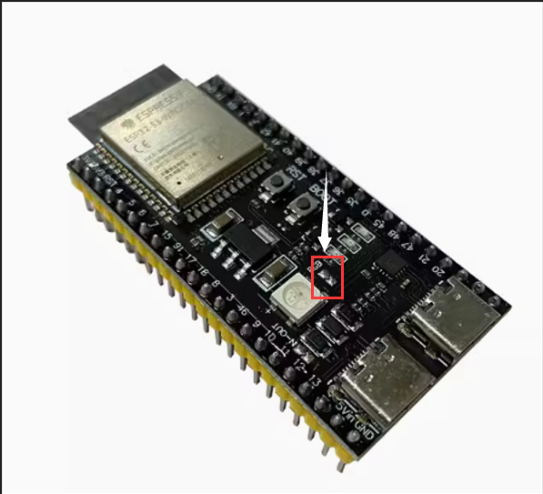
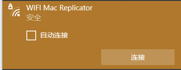

<!--
 * @Author: Z丶平凡
 * @Date: 2024-01-30 15:35:59
 * @LastEditTime: 2024-01-31 20:59:15
 * @LastEditors: Z丶平凡
 * @Description: In User Settings Edit
 * @FilePath: \WIFI_MacReplicator\README.md
-->
# **WIFI Mac Replicator**

**WIFI MAC地址测试工具 , 用于WIFI MAC地址测试 , 请勿用于非法用途**

本项目是用于修改ESP32S3的WIFI 广播MAC例程 , 集成开发环境用 PlatformIO 和 Arduino 框架开发实现的。

使用方法如下 : 

* 首先你可以选择安装 PlatformIO 对固件进行编译和烧录或者是用我提供的firmware.bin文件(放在firmwarebin文件夹下)直接烧录进ESP32S3的MCU里面

* 购买一片ESP32-S3-WROOM-1模组。

 

* 然后使用 **$\color{red}{\mathbf{flash\\\_download\\\_tool\\\_3.9.5.exe}}$** ESP32官方的烧写工具进行烧录,烧录之前先用烙铁把ESP32模块上面的RGB短接点接上。

 

* 固件烧录完成后LED会变成绿色快闪,2S后会转变为500ms每次的慢闪表示程序正在运行中。

 

* 当LED变成慢闪以后就可以看到名称为 : **$\color{red}{\mathbf{WIFI\_MacReplicator}}$** 的 WIFI设备 , 默认连接密码是 : **$\color{red}{\mathbf{12345678}}$​**

 

* 连接到WiFi 后打开浏览器网页地址栏输入 : [[192.168.4.100]](https://192.168.4.100)  即可访问Web端
* 在此可以输入你自己的wifi SSID和密码 , 并且输入对方WIFI的MAC地址保存即可
  * MAC地址的格式为：AA:BB:CC:DD:EE:FF

 

* 如果忘记WIFI密码可以在开机后长按BOOT按键5秒以上,LED会从绿灯闪烁状态变成静态红灯的状态,即可放开按键等待ESP32自动重启完成。并且恢复默认密码和SSID。

 

